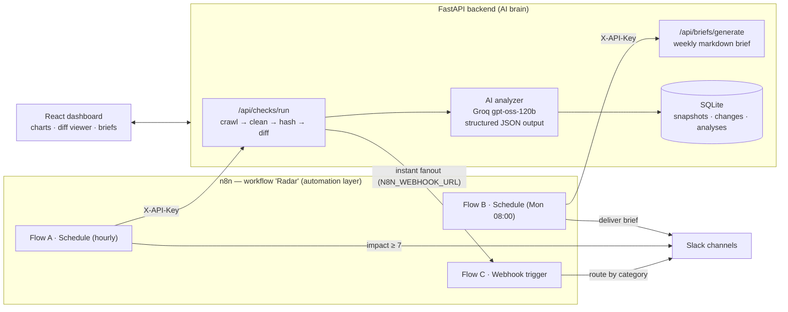

# 📡 Radar — AI-Powered Competitor Intelligence

**Know what your competitors changed — minutes after they change it.**

B2B teams usually find out about a competitor's pricing cut or feature launch weeks late,
from a lost deal. Radar watches competitors' pricing pages, changelogs, feature pages and
blogs; detects every change automatically; has an LLM analyze *what changed, why it
matters, and what to do about it*; and routes alerts to Slack — all orchestrated by an
**n8n automation workflow**.

> Built as a flagship AI-automation portfolio project: FastAPI + React + Groq
> (`openai/gpt-oss-120b`) + n8n, with a full zero-setup demo mode.

---

## Architecture



**Division of labor:** n8n owns *when things happen and where alerts go*
(schedules, branching on impact score, channel routing). FastAPI owns *the
intelligence* (crawling, change detection, AI analysis, storage). Either works
without the other — n8n enhances, never blocks.

## How the AI pipeline works

When a tracked page's content hash changes, the backend diffs the old and new
snapshots, extracts **only the changed regions**, and sends them to
`openai/gpt-oss-120b` on Groq with a strict JSON schema:

```python
class ChangeAnalysis(BaseModel):
    summary: str                 # what changed and why it matters
    category: Literal["pricing_change", "new_feature",
                      "messaging_change", "promotion", "other"]
    impact_score: int            # 1 (trivial) … 10 (urgent threat)
    recommended_action: str      # one concrete step for the team
```

Sample real output for a detected pricing change:

```json
{
  "summary": "Acme cut the Pro plan from $79 to $69 per user and introduced a usage-based 'Scale' add-on. This is a deliberate move against mid-market deals.",
  "category": "pricing_change",
  "impact_score": 8,
  "recommended_action": "Refresh the Acme battlecard with the new pricing and prep objection handling for Q2 renewals."
}
```

The response is validated with Pydantic (one retry on schema drift), stored with
the change event, and — if the impact clears the user's threshold — fanned out
to Slack via n8n.

## Features

- 🕐 **Hands-off monitoring** — n8n schedules hourly sweeps; manual "Check now" in the UI
- 🔍 **Change detection** — HTML cleaning + SHA-256 content hashing + line-level diffs
- 🧠 **AI change analysis** — summary, category, 1-10 impact score, recommended action
- 📰 **AI weekly brief** — executive markdown summary across all competitors
- 🔔 **Smart alerts** — in-app feed + Slack routing by category/impact via n8n
- 📊 **Enterprise dashboard** — activity & impact charts, change timeline, diff viewer
- 👥 **Multi-user** — JWT auth, per-user data scoping, per-user alert thresholds
- 🎭 **Demo mode** — full seeded experience with zero API keys and no n8n

## Run the demo in 3 commands

```bash
cd backend && python -m venv .venv && .venv\Scripts\pip install -r requirements.txt
.venv\Scripts\python -m app.seed_demo && start .venv\Scripts\python -m uvicorn app.main:app --port 8000
cd ../frontend && npm install && npm run dev
```

Open http://localhost:5173 → click **“Explore the live demo”**.
You get 4 competitors, 30 days of history, and 14 AI-analyzed changes — no keys needed.

## Going live

1. `cp backend/.env.example backend/.env` and set:
   - `GROQ_API_KEY` (free at console.groq.com) and `DEMO_MODE=false`
   - `SERVICE_API_KEY` — shared secret for n8n → API calls
2. Add real competitors and their pricing/changelog URLs in the UI.
3. Configure the n8n workflow: see [`n8n/README.md`](n8n/README.md) — one
   workflow named **Radar** with three flows (hourly checks, weekly brief,
   instant alert fanout), built programmatically via the **n8n MCP server**
   (a local-import JSON is also included at `n8n/workflows/radar.json`).
4. Set `N8N_WEBHOOK_URL` in the backend `.env` to enable instant fanout.

## Tech stack

| Layer | Tech |
|---|---|
| Automation | **n8n** (schedule + webhook triggers, Slack routing) |
| Backend | **FastAPI**, SQLAlchemy + SQLite, httpx, BeautifulSoup |
| AI | **Groq Cloud** — `openai/gpt-oss-120b`, JSON-schema structured outputs |
| Frontend | **React 19** + TypeScript, Vite, **Tailwind CSS v4**, Recharts |
| Auth | JWT (users) + static API key (machine/n8n callers) |

## Project structure

```
├── backend/app/
│   ├── routers/        auth · competitors · checks · changes · briefs · notifications · settings · stats
│   ├── services/       crawler · differ · ai_analyzer · brief_generator · alerts
│   └── seed_demo.py    one-command demo dataset
├── frontend/src/
│   ├── pages/          Dashboard · CompetitorDetail · ChangeDetail · Brief · Settings · Login
│   └── components/     charts · timeline · diff viewer · notification bell
└── n8n/workflows/radar.json   the "Radar" automation workflow (import into n8n)
```

## Screenshots

> `docs/screenshots/` — dashboard, change diff view, AI brief, n8n canvas.
