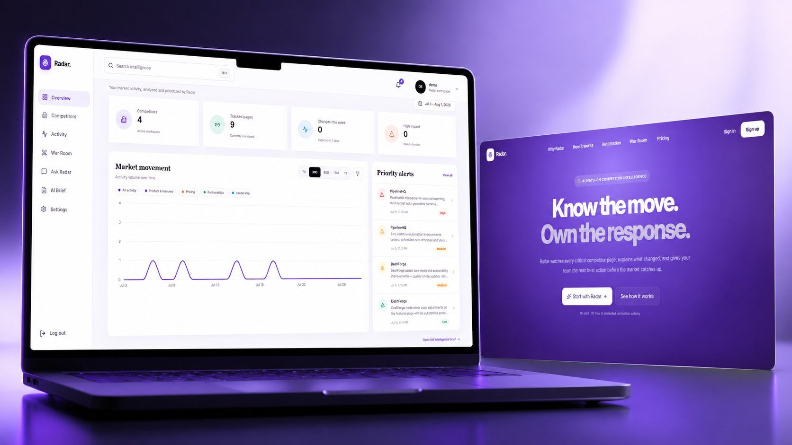

# Radar

Radar is an AI-powered competitor intelligence workspace for monitoring pricing, product, changelog, feature, and marketing pages. It detects meaningful changes, explains their impact, and turns them into focused actions for a product or revenue team.



## What it includes

- A polished landing page that explains the product and guides visitors into the demo or authentication flow.
- Email/password and Google authentication through Supabase Auth, with email verification, password reset, CAPTCHA protection, and session enforcement.
- An overview dashboard with market movement, priority alerts, tracked-page activity, and impact breakdowns.
- Competitor management with company logos, tracked URLs, page snapshots, changes, filters, and activity views.
- Change intelligence that cleans page HTML, hashes snapshots, creates diffs, categorizes changes, scores impact, and recommends an action.
- AI briefs, battlecards, predictions, War Room analysis, notifications, and settings.
- A seeded demo workspace that can run without paid AI or automation credentials.
- n8n and Slack integrations for scheduled checks, weekly briefs, and alert fan-out.

## Product flow

1. A user adds a competitor and one or more pages to monitor.
2. A scheduled or manual check fetches and cleans the page.
3. Radar compares the new snapshot with the previous one and stores the change.
4. The AI analyzer produces a structured summary, category, impact score, and recommendation.
5. The dashboard displays the result; high-impact changes can be routed to Slack through n8n.

## Architecture

Radar is split into three focused layers:

| Layer | Responsibility |
| --- | --- |
| React frontend | Landing page, authentication UI, dashboard, competitor workspace, charts, diffs, briefs, and settings. |
| FastAPI backend | Authenticated API, crawling, HTML cleaning, snapshot/diff processing, AI analysis, database access, and integrations. |
| Supabase + automation | Supabase Auth and PostgreSQL provide identity and persistence; n8n schedules jobs and routes alerts to Slack. |

The frontend uses Supabase Auth for identity and sends the resulting session to the API. The API maps authenticated users to the application profile and workspace data. Background checks and briefs can be started manually or by n8n webhooks.

## Tech stack

<p>
  
  
  
  
  
  
  
  
  
  
</p>

| Area | Tools |
| --- | --- |
| Frontend | React 19, TypeScript, Vite, Tailwind CSS v4, Recharts, Lucide icons |
| Backend | FastAPI, SQLAlchemy, Pydantic, httpx, BeautifulSoup, bcrypt, PyJWT |
| Data and auth | Supabase PostgreSQL, Supabase Auth, Row Level Security policies |
| Intelligence | Groq Cloud with structured JSON analysis |
| Automation | n8n workflows, webhooks, Slack notifications |
| Hosting | Vercel frontend and Render API |

## Project structure

```text
radar-intelligence/
├── backend/                         # FastAPI REST API and intelligence pipeline
│   ├── app/
│   │   ├── routers/                 # auth, competitors, changes, briefs, stats, war room
│   │   ├── services/                # crawler, differ, AI analysis, alerts, predictions
│   │   ├── auth.py                  # Supabase JWT/session verification
│   │   ├── database.py              # SQLAlchemy database session and configuration
│   │   ├── models.py                # application data models
│   │   ├── schemas.py               # request/response validation schemas
│   │   ├── main.py                  # API application entrypoint
│   │   └── seed_demo.py             # reproducible demo workspace seed
│   ├── requirements.txt
│   └── .env.example                 # backend configuration template
├── frontend/                        # React + TypeScript product interface
│   ├── src/
│   │   ├── api/                     # API client, Supabase client, shared types
│   │   ├── components/              # cards, charts, diffs, modals, logos, layout
│   │   ├── context/                 # authentication and session state
│   │   ├── pages/                   # landing, auth, dashboard, competitors, briefs, settings
│   │   ├── App.tsx                  # route and application shell
│   │   └── main.tsx                 # frontend entrypoint
│   ├── public/                      # static assets
│   └── .env.example                 # frontend configuration template
├── n8n/
│   ├── workflows/radar.json         # monitoring, briefs, and alert automation
│   └── README.md                    # workflow setup notes
├── docs/                            # supporting project documentation
├── Radar-mocup.png                  # dashboard product mockup
├── README.md
└── .gitignore
```

## Run locally

### Backend

```bash
cd backend
python -m venv .venv
.venv\Scripts\activate
pip install -r requirements.txt
copy .env.example .env
python -m app.seed_demo
python -m uvicorn app.main:app --reload --port 8000
```

### Frontend

```bash
cd frontend
npm install
npm run dev
```

Open <http://localhost:5173>. The seeded demo account is `demo@radar.app` with password `demo1234`.

## Configuration

Copy the environment examples before running a connected setup:

- `frontend/.env.example` for Supabase, Turnstile, and API URL settings.
- `backend/.env.example` for database, Supabase verification, Groq, and n8n settings.

Keep all secret keys in environment variables. Never commit SMTP passwords, JWT secrets, service keys, or API tokens.

## Automation workflow

The exported workflow is [`n8n/workflows/radar.json`](n8n/workflows/radar.json). It supports scheduled monitoring, weekly brief generation, and webhook-based alert fan-out. See [`n8n/README.md`](n8n/README.md) for setup notes.

## Deployment

- Frontend: Vercel
- Backend: Render
- Database and authentication: Supabase
- Automation: n8n Cloud

The frontend calls the Render API through `VITE_API_BASE_URL`; production secrets are configured in the hosting providers rather than stored in this repository.

## License

This repository is a portfolio and product prototype. Add the license that matches your intended distribution before publishing it for reuse.
